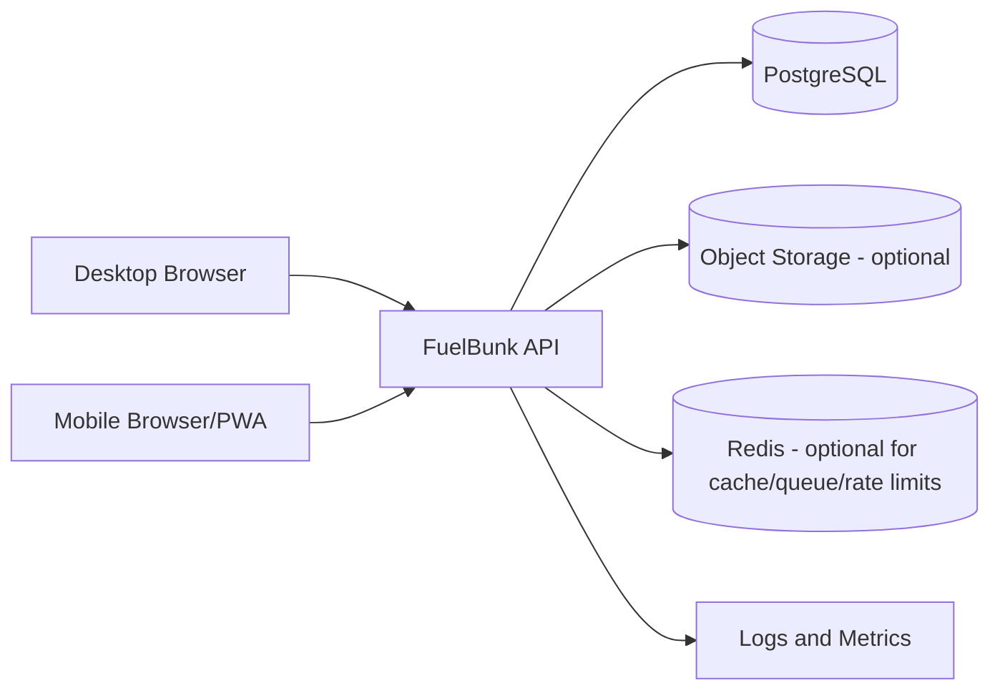

# FuelBunk Pro Architecture

## Architecture Style
- API-first REST architecture.
- Multi-tenant backend with strict tenant data isolation.
- Role-based access model across super admin, manager, and employee personas.
- Container-ready deployment for backend and supporting data services.

## High-Level Logical View

## Current Repository Mapping
- API entrypoint and middleware orchestration: src/backend/server.js
- Authentication and session endpoints: src/backend/auth.js
- Security middleware and helpers: src/backend/security.js
- Tenant and store data endpoints: src/backend/data.js
- Schema initialization and DB wrapper: src/backend/schema.js
- Frontend runtime and UI shell: src/frontend/index.html
- Frontend API adapter: src/frontend/api-client.js
- Legacy bridge compatibility: src/frontend/bridge.js

## Core Architectural Domains

### 1. Identity and Access
- Login flows for super admin, station admin, and employee PIN login.
- Session-backed authorization model with expiry and role checks.
- Route-level authorization by role and user type.

### 2. Tenant Isolation
- Every tenant-scoped operation includes tenant_id boundaries.
- No cross-tenant reads or writes allowed by API contract.
- Shared schema with tenant partitioning at query level (future hardening can include RLS).

### 3. Operations Data Model
Primary entities include:
- tenants
- admin_users
- employees
- shifts
- pumps
- tanks
- sales
- dip_readings
- expenses
- fuel_purchases
- credit_customers
- credit_transactions
- settings
- sessions
- audit_log

### 4. Workflow Processing

#### Employee Shift Flow
1. Employee logs in.
2. Opening reading is verified.
3. Employee records sales for assigned pump/nozzle/fuel.
4. Employee closes shift with final reading.
5. Manager verifies handover and closure.

#### Manager Operations Flow
1. Configure shifts and employee allocations.
2. Manage pump/nozzle assignments.
3. Monitor live shift status and sales trends.
4. Generate operational and attendance reports.

#### Super Admin Flow
1. Create and manage station tenants.
2. Manage tenant admins and global controls.
3. Govern platform-wide access and data boundaries.

## Consistency Rules
- Employee profile changes (name, shift, permissions) must propagate across all modules.
- Pump/nozzle/fuel configuration changes must be reflected in allocation and employee entry flows.
- Closing reading of one cycle should become next opening baseline where required.
- Credit, inventory, pump meter, and reporting data must reconcile against the same persisted source.

## Security and Resilience Controls
- Input sanitization and parameterized SQL.
- Session timeout and explicit browser-close/logout behavior.
- Rate limiting/throttling for API protection.
- Retry with backoff for transient failures.
- Timeout management and controlled request handling.
- Security verification against SQL injection and abuse traffic patterns.

## Deployment Architecture

### Pilot/Alpha
- Single backend service + PostgreSQL with persistent storage.
- Desktop and mobile browser access.
- Daily backup and restore process.

### Scale Stage
- Horizontally scaled stateless API replicas.
- Worker services for async tasks (reports, reconciliation, scheduled jobs).
- PostgreSQL primary + replica(s) + connection pooling.
- Redis for cache, counters, and queueing.
- Observability with centralized logs, metrics, and alerts.

## Architecture Decision Notes
1. Data store direction evolved across discussions.
- Early options mentioned SQLite (alpha POC) and NoSQL alternatives.
- Later recommendations prioritize PostgreSQL for ACID financial workflows and reporting.

2. Employee portal direction needs explicit product decision.
- One note requests removing it.
- Later notes add multiple employee portal enhancements.

3. Final production topology should be selected after confirming:
- Target load profile.
- Hosting economics (Railway vs Render).
- Security and compliance baseline.
